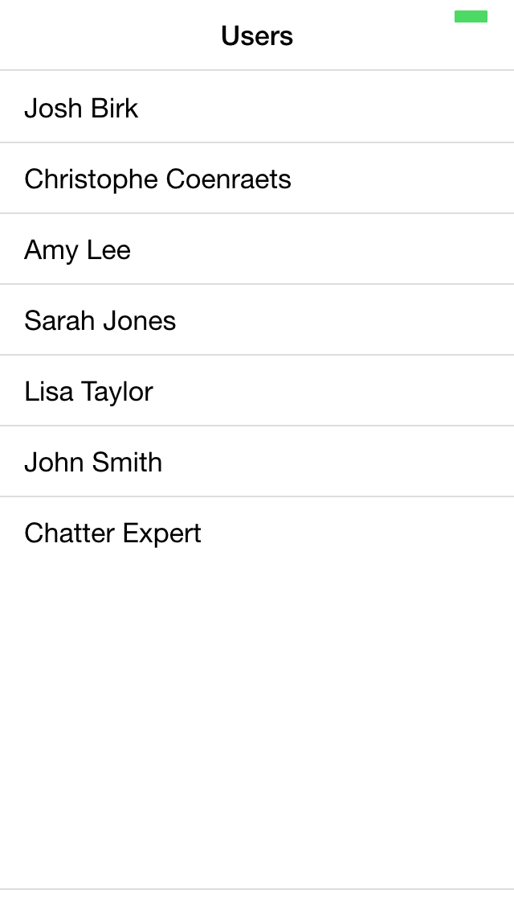
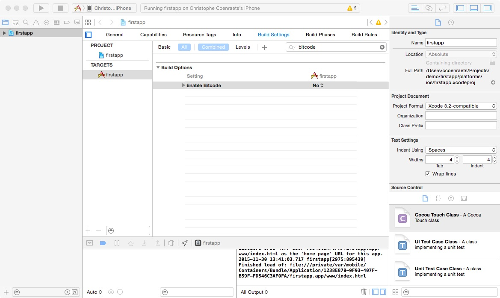
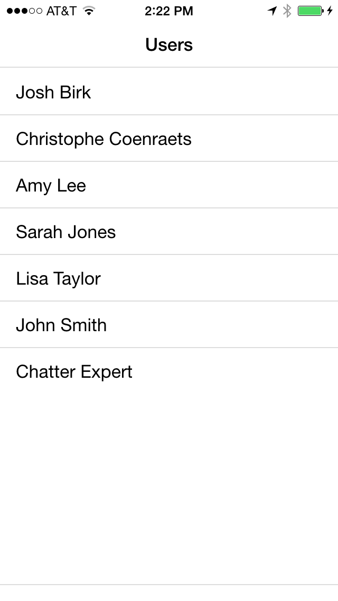
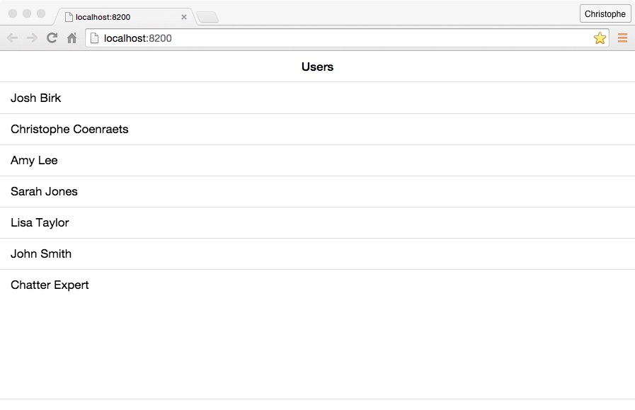

There are two ways to create a hybrid application with the Mobile SDK:

1. Using the Mobile SDK Command Line Interface (CLI)
1. Using the Cordova CLI, and installing the Salesforce Mobile SDK as a Cordova plugin

> The Salesforce Mobile SDK CLI wraps the Cordova CLI: In addition to creating a Cordova project, it automatically sets up the Mobile SDK plugin and config file (bootconfig.json).

We cover the first approach in this module, and the second approach in the [next module](mobilesdk-plugin.html).

## Step 1: Create the Project

To create a Salesforce application using the Mobile SDK CLI:

1. Install [Node.js](https://nodejs.org) if it's not already installed on your computer (Cordova and the Salesforce Mobile SDK are installed using **npm**, the Node.js Package Manager).

1. Install Cordova and the Salesforce Mobile SDK for the platform of your choice. For example, for iOS:

    ```
    npm install -g cordova forceios
    ```

    On a Mac, you may have to use sudo:

    ```
    sudo npm install -g cordova forceios
    ```

    > To install the Mobile SDK CLI for Android, replace ```forceios``` with ```forcedroid```.

1. Create a new mobile application:

    ```
    forceios create
    ```

1. Answer the prompts as follows (adjust the company id and organization name as needed):

    ```
    Enter your application type (native, hybrid_remote, or hybrid_local): hybrid_local
    Enter your application name: firstapp
    Enter the output directory for your app (defaults to the current directory):
    Enter your company identifier (com.mycompany): com.mycompany.firstapp
    Enter your organization name (Acme, Inc.): MyCompany, Inc.
    Enter your Connected App ID (defaults to the sample app’s ID):
    Enter your Connected App Callback URI (defaults to the sample app’s URI):
    ```

    >When you don't provide values for the Connected App Id and Callback URI, the Mobile SDK defaults to a sample Connected App that is suitable for development and testing. For a production application, you should create a Connected App in Salesforce and provide your own Connected App ID and Callback URI.

1. Navigate (cd) to the project directory:

    ```
    cd firstapp
    ```

    Examine the directory structure. The ```www``` directory contains the web
    application.

## Step 2: Run the App on Device

To run the application on a mobile device or in an emulator, you need the vendor's SDK for the target platform installed on your computer (for example, you need Xcode and the iOS SDK to build the app for iOS, and the Android SDK to build the app for Android). If you don't have a vendor SDK available on your computer, you can still run the application in your browser. In that case, skip this step and go directly to step 3 below.

1. Add some useful Cordova plugins (optional):

    ```
    cordova plugin add cordova-plugin-console
    cordova plugin add cordova-plugin-statusbar
    ```

    > Check out [this page](https://cordova.apache.org/docs/en/latest/guide/cli/index.html) in the Cordova documentation for more information on the Cordova CLI and plugins.

1. Build the project:

    ```
    cordova build
    ```

1. Run the project. For example, for iOS, open the project (`platforms/ios/firstapp.xcodeproj`) in Xcode and run it in the emulator or on your iOS device.

    <div class="picture-frame">
        
        
    </div>

    >If the build fails in Xcode, select the firstapp target, click the **Build Settings** tab, search for **bitcode**, select **No** for **Enable Bitcode**, and try again.
    
    
    
To make sure the header of your application doesn't collide with the iOS status bar:

1. Make sure you installed the status bar plugin as described above

1. Add the following preferences to your project’s **config.xml**:

    ```
    <preference name="DisallowOverscroll" value="true"/>
    <preference name="StatusBarOverlaysWebView" value="false" />
    <preference name="StatusBarBackgroundColor" value="#ffffff" />
    <preference name="StatusBarStyle" value="default" />
    ```

1. Rebuild and run the project

    <div class="picture-frame">
        
    </div>

## Step 3: Modify the Sample App

The sample application is built with [ForceTK](https://github.com/developerforce/Force.com-JavaScript-REST-Toolkit), the Force.com JavaScript REST Toolkit. In this section, we modify the application to use [ForceJS](https://github.com/ccoenraets/forcejs) instead of ForceTK. ForceJS is similar to ForceTK with a few differences:

- ForceJS has no jQuery dependency
- ForceJS provides a full implementation of the OAuth workflow when running in the browser
- ForceJS allows you to run your app on device and in the browser without any code modification, greatly improving the developer experience. When running on device, the authentication process is handled by the Mobile SDK OAuth plugin. When running in the browser, ForceJS provides a full implementation of the OAuth workflow.
- ForceJS is also available as an [Angular 1.x module](https://github.com/ccoenraets/forceng) and an [ECMAScript 6 module](https://github.com/ccoenraets/forcejs/tree/es6).
- ForceJS comes with [force-server](https://github.com/ccoenraets/force-server), a companion development server.

To modify the application to use ForceJS:

1. [Download](https://github.com/ccoenraets/forcejs/archive/master.zip) forcejs.

1. Copy the ```force.js``` file in the ```firstapp/www/js``` folder.

1. Delete ```forcetk.mobilesdk.js``` and ```jquery.js``` from the ```firstapp/www/js``` folder

1. Open ```firstapp/www/index.html``` in your favorite code editor and make the following changes:
    - Remove the ```jquery``` script tag
    - On the next line, replace ```js/forcetk.mobilesdk.js``` with ```js/force.js```

1. Open ```www/js/app.js``` in your favorite code editor and examine the code.

    >Notice that, as it is, the code works with a direct reference to the Mobile SDK plugin. As a result, you can only run the app on device or in an emulator: you can't test it in the browser first and run it on device later.

1. Remove the existing code, and replace it with the following code:

    ```
    force.login(function() {
        force.query('SELECT Id, Name FROM User LIMIT 10', function (response) {
            var html = '';
            var users = response.records;
            for (var i = 0; i < users.length; i++) {
                html += '<li class="table-view-cell">' + users[i].Name + '</li>';
            }
            document.getElementById('users').innerHTML = html;
        });
    });
    ```

    >force.login() abstracts the authentication process. When running in Cordova,
    force.login() leverages the Mobile SDK OAuth plugin. When running in the
    browser, force.login() provides a full implementation of the OAuth workflow.


1. Rebuild the project

    ```
    cordova build
    ```

1. Run the project


## Step 4: Run the App in the Browser

As mentioned above, one of the benefits of ForceJS is that you can run the application in the browser or on device without code modification. To run the application in the browser, we use [force-server](https://github.com/ccoenraets/force-server), a simple development server aimed at providing a simple and integrated developer experience when building applications that use Salesforce OAuth and REST services. force-server provides two main features:

- A Local Web Server to (1) serve the OAuth callback URL defined in your Connected App, and (2) serve the whole app during development and avoid cross-domain policy issues when loading files (for example, templates) from the local file system.
- A Proxy Server to avoid cross-domain policy issues when invoking Salesforce REST services. (The Chatter API supports CORS, but other APIs don’t yet)

To run the application in the browser using force-sever:

1. Install force-server

    ```
    npm install -g force-server
    ```

    or

    ```
    sudo npm install -g force-server
    ```

1. Navigate (cd) to your app's ```www``` directory

1. Start the server

    ```
    force-server
    ```

    This command will start the server on port 8200, and automatically load your app (http://localhost:8200) in a browser window. You'll see the Salesforce login window (make sure you enable the popup), and the list of contacts will appear after you log in. If you don’t have a free Salesforce Developer Edition to log in to, you can create one [here](https://developer.salesforce.com/signup).

    

    You can change the port number and the web root. Type the following command for more info:

    ```
    force-server --help
    ```


<div class="row" style="margin-top:40px;">
<div class="col-sm-12">
<a href="index.html" class="btn btn-default"><i class="glyphicon glyphicon-chevron-left"></i> Previous</a>
<a href="mobilesdk-plugin.html" class="btn btn-default pull-right">Next <i class="glyphicon glyphicon-chevron-right"></i></a>
</div>
</div>
