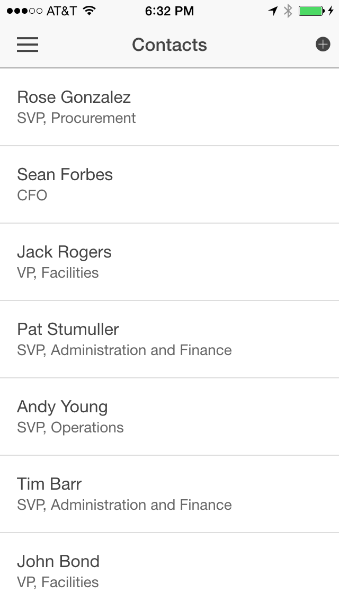

Salesforce and Ionic collaborated to create a [Salesforce Starter Application for Ionic](https://github.com/driftyco/ionic-starter-salesforce). You can create a Salesforce starter application directly from the Ionic CLI. The starter application is preconfigured to work with the Salesforce Mobile SDK. It uses Salesforce OAuth to authenticate, and the Salesforce REST APIs to access and manipulate Salesforce data.

## Step 1: Create the Application

1. Make sure Cordova is installed on your computer

1. Install the Ionic CLI

    ```
    npm install -g ionic
    ```

    On a Mac, you may have to use sudo:

    ```
    sudo npm install -g ionic
    ```

1. Create a Salesforce application using the Ionic CLI:

    ```
    ionic start MyIonicApp salesforce
    ```
    - `MyIonicApp` is the name of your app
    - `salesforce` is the name of the Ionic template to use when creating the app

1. Navigate (cd) to the `MyIonicApp` directory and examine the project structure

1. Add the Salesforce Mobile SDK plugin:

    ```
    cordova plugin add https://github.com/forcedotcom/SalesforceMobileSDK-CordovaPlugin
    ```


## Step 2: Run the App on Device

To run the application on a mobile device or in an emulator, the SDK for the mobile platform you target needs to be installed on your computer. For example, you need Xcode and the iOS SDK to build the app for iOS, and you need the Android SDK to build the app for Android. If the SDK is not installed on your computer, you won't be able to build the app for that platform, but you can still run the application in your browser. In that case, skip this step and go directly to Step 3 below.

1. Build the app for a specific platform. For example, to build the app for iOS:

    ```
    ionic build ios
    ```

1. Run the project. For example, for iOS, open the project (`platforms/ios/MyIonicApp.xcodeproj`) in Xcode and run it in the emulator or on your iOS device.

    <div class="picture-frame">
        
        
    </div>

    <div class="picture-frame">
        
        
    </div>


    >If the build fails in Xcode, select the MyIonicApp target, click the **Build Settings** tab, search for **bitcode**, select **No** for **Enable Bitcode**, and try again.

## Step 3: Run the App in the Browser

To run the application in the browser using force-sever:

1. Make sure force-server is installed on your system

1. Navigate (cd) to your project's ```www``` directory

1. Start the server

    ```
    force-server
    ```

    This command will start the server on port 8200, and automatically load your app (http://localhost:8200) in a browser window. You'll see the Salesforce login window (make sure you enable the popup), and the list of contacts will appear after you log in. 

    

    You can change the port number and the web root. Type the following command for more info:

    ```
    force-server --help
    ```

<div class="row" style="margin-top:40px;">
<div class="col-sm-12">
<a href="mobilesdk-plugin.html" class="btn btn-default"><i class="glyphicon glyphicon-chevron-left"></i> Previous</a>
<a href="mobilesdk-hybrid-remote.html" class="btn btn-default pull-right">Next <i class="glyphicon glyphicon-chevron-right"></i></a>
</div>
</div>
