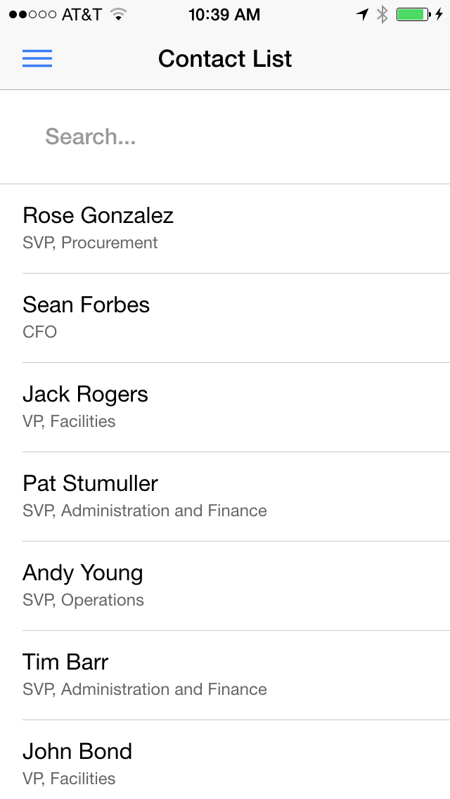
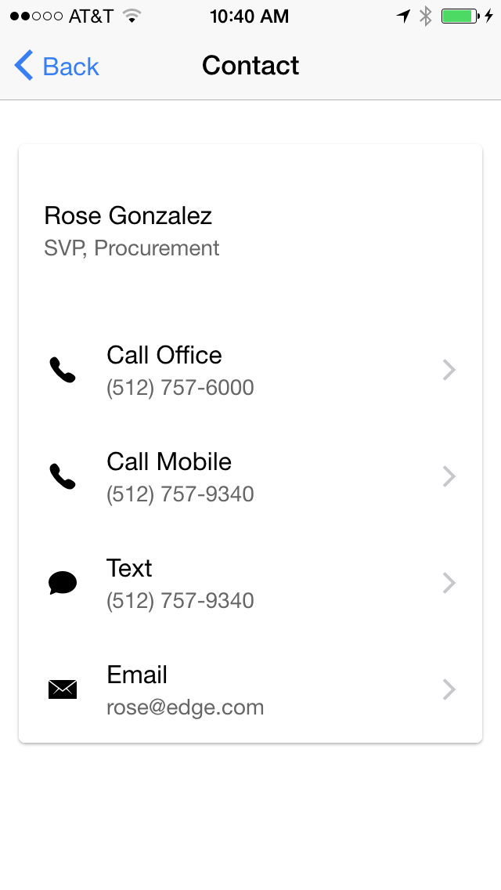

**NOTE: This is a preview. Both AngularJS 2 and Ionic 2 are in alpha. The code is subject to change.**

In this module we run and build a simple Contact Manager application built with Ionic 2, ECMAScript 6, and the Salesforce Mobile SDK. The code for this application is maintained in [this repository](https://github.com/ccoenraets/ionic2-salesforce-sample).

<div class="picture-frame three-pictures">
    
    
    
</div>


Instead of its version 1 custom module infrastructure, Angular 2 now uses ECMAScript 6 modules, which streamlines the integration with third-party libraries: no need for Angular wrappers or Angular-specific versions of third-party libraries anymore. For example, the latest version of the forcejs OAuth and REST library for Salesforce is implemented as an ECMAScript 6 module, and that’s all you need for a natural and elegant integration with Angular 2. More information on the latest version of forcejs is available [here](https://github.com/ccoenraets/forcejs/tree/es6).

Here is a quick look at the ContactService module that provides the data to the application:

```
import * as force from 'forcejs';
 
export let findAll = () => force.query(
        `SELECT Id, Name, Title, Phone, MobilePhone, Email
         FROM Contact LIMIT 20`);
 
export let findByName = (name) => force.query(
        `SELECT Id, Name, Title, Phone, MobilePhone, Email
         FROM Contact WHERE name LIKE '%${name}%' LIMIT 20`);
```         
         
### ECMAScript 6 Code Highlights:

- Use of Modules: ContactService itself is defined as a module exporting two functions (findAll() and findByName()). ContactService also leverages (imports) the forcejs module.
- Template strings: ES6 multi-line template strings are used to write the SOQL statements cleanly over multiple lines, and insert query parameters without the need for string concatenation.
- Promises: findAll() and findByName() return an ES6 promise (the return value of force.query()).
- Block-scoped let variables, arrow functions, etc.

## Check it Out: Run the Hosted Version

Click [here](https://contact-force.herokuapp.com/) to run a hosted version of the application in your browser.

> You may have to explicitly allow the OAuth login window in your browser's popup blocker the first time you run the application.

## Build and Run Locally

1. Open a command prompt and type the following command to install Ionic 2 alpha:
    ```
    npm install -g ionic@alpha
    ```

1. Type the following command to create a version 2 project called ContactManager:
    ```
    ionic start ContactManager --v2
    ```

1. Navigate to your project directory:
    ```
    cd ContactManager
    ```
    
1. Install the forcejs OAuth and REST library for Salesforce:
    ```
    npm install forcejs --save-dev
    ```

1. Replace www with the www folder of [this repository](https://github.com/ccoenraets/ionic2-salesforce-sample)

1. Type the following command to transpile the application, start the development server, and load the application in your default browser:

    ```
    ionic serve
    ```


## Run on Device using the Mobile SDK

1. On the command prompt, make sure you are in your project (ContactManager) directory and type the following command to add the Salesforce Mobile SDK plugin:

    ```
    cordova plugin add https://github.com/forcedotcom/SalesforceMobileSDK-CordovaPlugin
    ```

1. Create the Salesforce Mobile SDK config file (bootconfig.json) in the www folder of your project:

    ```
    {
      "remoteAccessConsumerKey": "3MVG9Iu66FKeHhINkB1l7xt7kR8czFcCTUhgoA8Ol2Ltf1eYHOU4SqQRSEitYFDUpqRWcoQ2.dBv_a1Dyu5xa",
      "oauthRedirectURI": "testsfdc:///mobilesdk/detect/oauth/done",
      "oauthScopes": [
        "web",
        "api"
      ],
      "isLocal": true,
      "startPage": "index.html",
      "errorPage": "error.html",
      "shouldAuthenticate": true,
      "attemptOfflineLoad": false
    }
    ```
    
1. Type the following command to build the project:

    ```
    ionic build ios
    ```

1. Run the project. For example, for iOS, open the project (`platforms/ios/ContactForce.xcodeproj`) in Xcode and run it in the emulator or on your iOS device.

    >If the build fails in Xcode, select the firstapp target, click the **Build Settings** tab, search for **bitcode**, select **No** for **Enable Bitcode**, and try again.

<div class="row" style="margin-top:40px;">
<div class="col-sm-12">
<a href="mobilesdk-hybrid-remote.html" class="btn btn-default"><i class="glyphicon glyphicon-chevron-left"></i> Previous</a>
</div>
</div>
