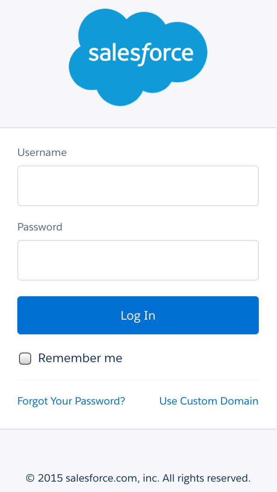
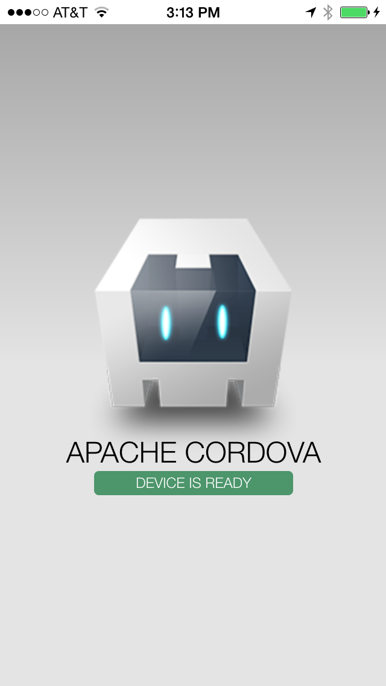
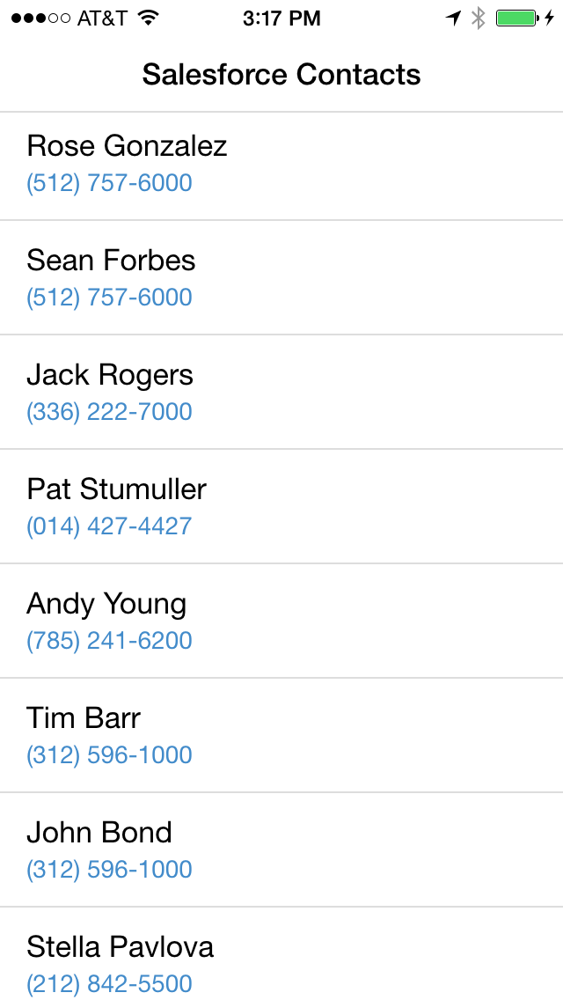
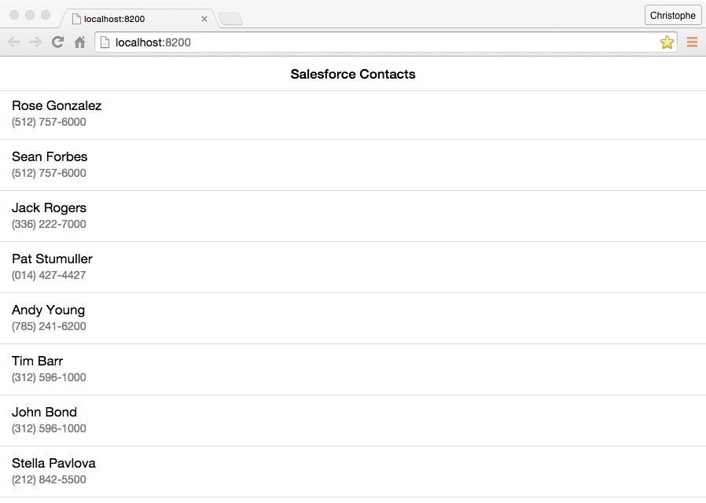

As mentioned in the previous module, there are two ways to create a hybrid application with the Mobile SDK:

1. Using the Mobile SDK Command Line Interface (CLI)
1. Using the Cordova CLI, and installing the Salesforce Mobile SDK as a Cordova plugin

We covered the first approach in the [previous module](mobilesdk-cli.html) and cover the second approach in this module.

## Step 1: Create a Cordova Application

To create an application using the Cordova CLI:

1. Make sure Cordova is installed on your computer

    ```
    npm install -g cordova
    ```

    On a Mac, you may have to use sudo:

    ```
    sudo npm install -g cordova
    ```

1. Create a new application:

    ```
    cordova create contactmanager com.mycompany.contactmanager ContactManager
    ```

1. Navigate (cd) to the project directory

    ```
    cd contactmanager
    ```

1. Add some useful Cordova plugins (optional):

    ```
    cordova plugin add cordova-plugin-device
    cordova plugin add cordova-plugin-console
    cordova plugin add cordova-plugin-statusbar
    ```

    > Check out [this page](https://cordova.apache.org/docs/en/latest/guide/cli/index.html) in the Cordova documentation for more information on the Cordova CLI and plugins


## Step 2: Add the Salesforce Mobile SDK Plugin

1. Add the Salesforce Mobile SDK plugin:

    ```
    cordova plugin add https://github.com/forcedotcom/SalesforceMobileSDK-CordovaPlugin
    ```

1. Create the Salesforce Mobile SDK config file (bootconfig.json) in the **www** folder of your project:

    ```
    {
      "remoteAccessConsumerKey": "3MVG9Iu66FKeHhINkB1l7xt7kR8czFcCTUhgoA8Ol2Ltf1eYHOU4SqQRSEitYFDUpqRWcoQ2.dBv_a1Dyu5xa",
      "oauthRedirectURI": "testsfdc:///mobilesdk/detect/oauth/done",
      "oauthScopes": [
        "web",
        "api"
      ],
      "isLocal": true,
      "startPage": "index.html",
      "errorPage": "error.html",
      "shouldAuthenticate": true,
      "attemptOfflineLoad": false
    }
    ```

    > For a production application, you should create a Connected App in Salesforce and provide your own Connected App ID and Callback URI.


## Step 3: Build and Run

To run the application on a mobile device or in an emulator, you need the vendor's SDK for the target platform installed on your computer (for example, you need Xcode and the iOS SDK to build the app for iOS, and the Android SDK to build the app for Android). If you don't have a vendor SDK available on your computer, you can still run the application in the browser on your computer. In that case, skip this step and go directly to step 4 below.

1. To make sure the header of your application doesn't collide with the iOS status bar, add the following preferences to your project’s **config.xml**:

    ```
    <preference name="DisallowOverscroll" value="true"/>
    <preference name="StatusBarOverlaysWebView" value="false" />
    <preference name="StatusBarBackgroundColor" value="#ffffff" />
    <preference name="StatusBarStyle" value="default" />
    ```

1. Add a platform. For example to add iOS:

    ```
    cordova platform add ios
    ```

1. Build for the platform you added. For example to build for iOS:

    ```
    cordova build ios
    ```

1. Run the project. For example, for iOS, open the project (`platforms/ios/ContactManager.xcodeproj`) in Xcode and run it in the emulator or on your iOS device

    <div class="picture-frame">
        
        
    </div>

    >If the build fails in Xcode, select the ContactManager target, click the **Build Settings** tab, search for **bitcode**, select **No** for **Enable Bitcode**, and try again.

## Step 4: Access Salesforce Data

1. [Download](https://github.com/ccoenraets/forcejs/archive/master.zip) forcejs.
See the [previous module](mobilesdk-cli.html) for more information on forcejs.

1. Copy the ```force.js``` file in the ```contactmanager/www/js``` folder.

1. Open ```index.html``` in your favorite code editor. Replace the existing content of the file with the following code:

    ```
    <!DOCTYPE html>
    <html>
    <head>
        <meta charset="utf-8">
        <meta name="viewport" content="initial-scale=1, maximum-scale=1, user-scalable=no">
        <link href="https://cdnjs.cloudflare.com/ajax/libs/ratchet/2.0.2/css/ratchet.css" rel="stylesheet">
        <script src="cordova.js"></script>
        <script src="js/force.js"></script>
        <script src="js/app.js"></script>
    </head>
    <body>
        <header class="bar bar-nav">
            <h1 class="title">Salesforce Contacts</h1>
        </header>
        <div class="content">
            <ul id="contacts" class="table-view"></ul>
        </div>
    </body>
    </html>
    ```

1. Open ```js/app.js``` in your favorite code editor. Replace the existing content of the file with the following code:

    ```
    function showContacts() {
        force.query('SELECT Name, Phone FROM Contact LIMIT 20',
            function(data) {
                var contacts = data.records,
                    html = '';
                for (var i=0; i < contacts.length; i++) {
                    html += ('<li class="table-view-cell"><div class="media-body">' +
                                contacts[i].Name + '<p>' + contacts[i].Phone +
                                '</p></div></li>');
                }
                document.querySelector('#contacts').innerHTML = html;
            },
            function(error) {
                alert("Can't load contacts: " + error);
            });
    }

    force.login(showContacts, function(error) {
        alert('Authentication failed: ' + error);
    });
    ```

1. Rebuild the project

    ```
    cordova build ios
    ```

1. Run the project

    <div class="picture-frame">
        
    </div>


## Step 5: Run in the Browser

To run the application in the browser using force-sever:

1. Make sure force-server is installed on your computer. See the [previous module](mobilesdk-cli.html) for more information about force-server.

1. Navigate (cd) to your project's ```www``` directory

1. Start the server

    ```
    force-server
    ```

    This command will start the server on port 8200, and automatically load your app (http://localhost:8200) in a browser window. You'll see the Salesforce login window (make sure you enable the popup), and the list of contacts will appear after you log in. 

    

    You can change the port number and the web root. Type the following command for more info:

    ```
    force-server --help
    ```
    
<div class="row" style="margin-top:40px;">
<div class="col-sm-12">
<a href="mobilesdk-cli.html" class="btn btn-default"><i class="glyphicon glyphicon-chevron-left"></i> Previous</a>
<a href="mobilesdk-ionic.html" class="btn btn-default pull-right">Next <i class="glyphicon glyphicon-chevron-right"></i></a>
</div>
</div>
    
